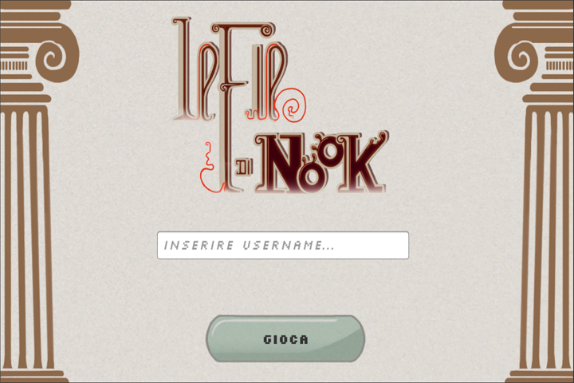
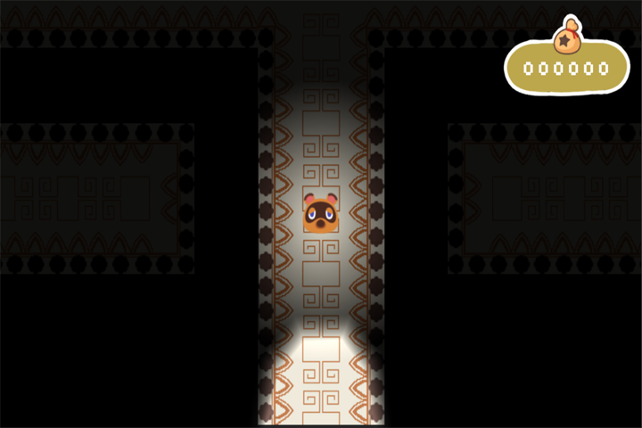
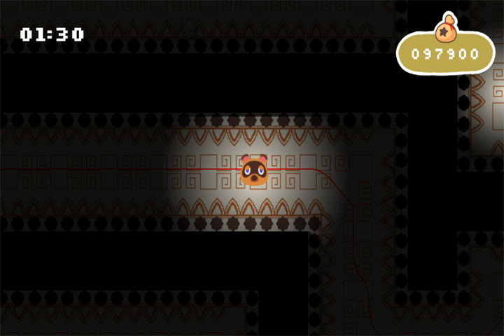

Gioco in 2D con visuale dall'alto sviluppato con Unity in C# per un evento nel forum di Animal Crossing Life. Game art designed by [leramyce](https://www.instagram.com/leramyce/)

## Scopo del gioco
Il giocatore deve raggiungere il tesoro nascosto nel labirinto e portarlo fuori prima che la struttura crolli! Durante la fuga il giocatore, ad ogni passo, perderà alcuni soldi ottenuti fino a quel momento.

## Come giocare
  

- **WASD/Frecce** per muovere il personaggio.
- **Spacebar** per interagire con il tesoro e per uscire più velocemente dalla buca.

## Feature
- Luce/ombre 2D dinamiche realizzate con il supporto di Universal RP, framework di Unity.
- Funzione degli Webhooks utilizzando Discord. Permette l'invio in tempo reale delle informazioni del giocatore in un server su Discord, quando il gioco viene completato con successo!

## Dove giocare
Per poter provare il gioco basta cliccare su [questo link](https://michisco.github.io/NookThread_Game/).
Per poter giocare dovete utilizzare un nickname (se non fate parte del forum di ACL, vi chiedo gentilmente di usare il nickname **"Visitatore"**) e premere il bottone sottostante per poter iniziare a giocare. 
(If you are not a ACL forum's user, you'll have to access with the nickname **"Visitor"**)

*Credit to Nintendo* 
